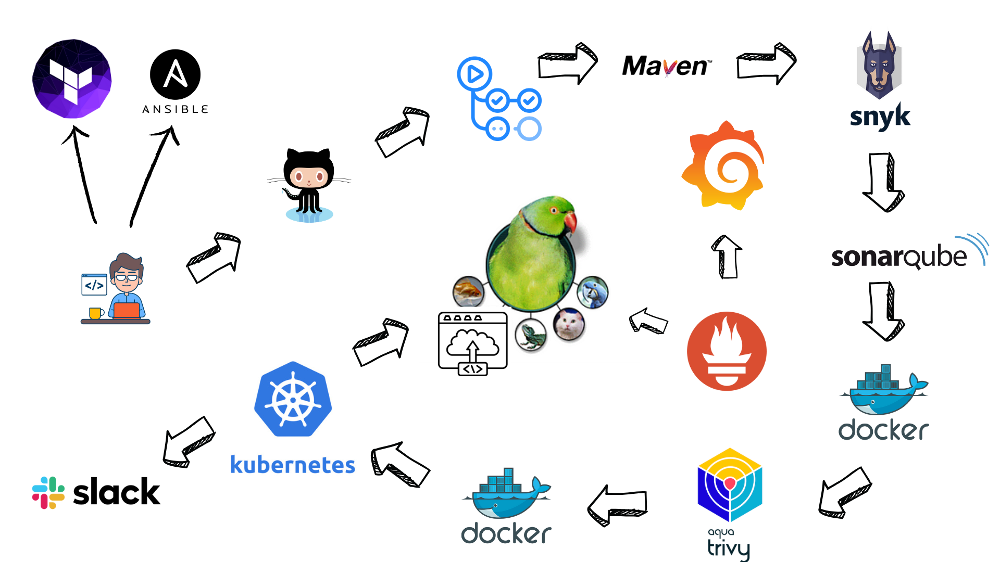

# Deploy Java Web Application to EKS Cluster


*Overall architecture of Java application deployment to EKS with security and monitoring components*

## Table of Contents
- [Introduction](#introduction)
- [Prerequisites](#prerequisites)
- [Tools Used](#tools-used)
- [Project Structure](#project-structure)
- [Implementation Phases](#phases-of-implementation)
  - [Infrastructure Setup](#phase-1-infrastructure-setup)
  - [Security Configuration](#phase-2-ansible-automation-and-security)
  - [Application Setup](#phase-3-application-setup)
  - [CI/CD Pipeline](#phase-4-cicd-pipeline-setup)
  - [Deployment & Monitoring](#phase-5-deployment-and-monitoring)

## Introduction

In this project, we will walk through the process of deploying a Java web application to an Amazon EKS cluster. We will use various tools and technologies to automate the infrastructure provisioning, application deployment, and monitoring setup. The CI/CD pipeline will ensure that the application is built, tested, and deployed seamlessly.

## Prerequisites

- AWS account
- Terraform installed
- Ansible installed
- GitHub account
- Docker installed
- kubectl installed

## Tools Used

- **Terraform**: For provisioning AWS resources.
- **Kubernetes**: For container orchestration.
- **Docker**: For containerizing the Java web application.
- **Ansible**: For automating the setup of SonarQube and EKS worker nodes.
- **GitHub Actions**: For setting up the CI/CD pipeline.
- **Prometheus and Grafana**: For monitoring the application and infrastructure.
- **Maven**: For building and testing the Java application.
- **Snyk**: For dependency vulnerability scanning.
- **SonarQube**: For code quality analysis.
- **Trivy**: For Docker image vulnerability scanning.

## Project Structure

```
deploy-java-app-to-eks-cluster/
├── ansible/
│   ├── ansible.cfg
│   ├── files/
│   │   └── sonarqube-docker-compose.yml
│   ├── inventory/
│   │   ├── group_vars/
│   │   │   └── eks_workers.yml
│   │   └── hosts
│   ├── playbooks/
│   │   ├── eks-tools.yml
│   │   ├── kube-prometheus-stack.yml
│   │   └── sonarqube-setup.yml
├── kubernetes/
│   ├── deployment.yaml
│   ├── hpa.yaml
│   ├── mysql-deployment.yaml
│   ├── mysql-pv-claim.yaml
│   ├── mysql-secret.yaml
│   ├── mysql-service.yaml
│   ├── service.yaml
├── terraform/
│   ├── backup.tf
│   ├── iam.tf
│   ├── main.tf
│   ├── outputs.tf
│   ├── prometheus_grafana.tf
│   ├── provider.tf
│   └── variables.tf
├── .github/
│   └── workflows/
│       └── devsecops.yml
├── Dockerfile
├── README.md
└── docs/
    └── images/
        └── architecture.png
```

## Phases of Implementation

### Phase 1: Infrastructure Setup

1. **Provision AWS Resources with Terraform:**
   - ***Set up VPC, subnets, NAT gateway, and route tables:***
     - **main.tf**: This file contains the main Terraform configuration for setting up the VPC, subnets, NAT gateway, route tables, and security groups.
       - Creates a VPC with CIDR block.
       - Creates public and private subnets.
       - Sets up a NAT gateway and associated route tables.
       - Creates security groups for SonarQube and EKS worker nodes.
   - ***Create an EKS cluster and associated resources:***
     - **main.tf**: This file also includes the configuration for creating the EKS cluster and its worker nodes.
       - Creates an EKS cluster.
       - Configures EKS worker nodes with necessary IAM roles and instance profiles.
   - ***Provision an EC2 instance for SonarQube:***
     - **main.tf**: This file includes the configuration for provisioning an EC2 instance for SonarQube.
       - Creates an EC2 instance with the necessary security group and IAM role.
   - ***Backup Configuration:***
     - **backup.tf**: Configures AWS Backup for EKS cluster
       - Creates AWS Backup vault
       - Sets up daily backup plan
       - Configures 14-day retention policy
       - Sets up IAM roles for backup
       - Tags EKS cluster for backup selection
   - ***Terraform Configuration Files:***
     - **provider.tf**: Centralizes all provider configurations
       - Configures AWS, Kubernetes, and Helm providers
       - Uses EKS authentication for K8s and Helm
       - Sets up AWS region and provider versions
     - **backend.tf**: Configures S3 backend for state storage
     - **main.tf**: Main infrastructure configuration
     - **variables.tf**: Variable definitions
     - **prometheus_grafana.tf**: Monitoring stack configuration
       - Deploys Prometheus with EKS-specific configurations
       - Sets up Grafana with automatic Prometheus integration
       - Configures IAM roles for monitoring access
     - **backup.tf**: EKS backup configurations
   - For more details, refer to the [Terraform folder](./terraform).

2. **To provision these resources, run the following commands:**
   - **Step 1: Initialize Terraform**
     ```sh
     terraform init
     ```
   - **Step 2: Validate the Terraform Configuration**
     ```sh
     terraform validate
     ```
   - **Step 3: Plan the Terraform Deployment**
     ```sh
     terraform plan
     ```
   - **Step 4: Apply the Terraform Configuration**
     ```sh
     terraform apply
     ```

3. **Verify SonarQube:**
   - **SonarQube**:
     - After provisioning the SonarQube server, you can verify if it is up and running by accessing the SonarQube web interface.
     - Open a web browser and navigate to the SonarQube server URL (e.g., `http://<SonarQube-EC2-IP>:9000`).
     - Log in using the default admin credentials:
       - Username: `admin`
       - Password: `admin`
     - You will be prompted to change the default password after the first login.

### Phase 2: Ansible Automation and Security

1. **SonarQube Setup**
   - Use Ansible to install and configure SonarQube on the EC2 instance.
   - The playbook `sonarqube-setup.yml` will:
     - Install Docker and Docker Compose on the EC2 instance.
     - Use a Docker Compose file to set up SonarQube and its dependencies.
     - Ensure SonarQube is running and accessible.
   - **sonarqube-docker-compose.yml Explanation:**
     - `version: "3"`: Specifies the version of the Docker Compose file format.
     - `services`: Defines the services that will be run.
       - `sonarqube`: The service for running SonarQube.
         - `image: sonarqube:lts-community`
         - `ports`:
           - `- "9000:9000"`
         - `environment`:
           - `SONARQUBE_JDBC_URL=jdbc:postgresql://localhost:5432/sonar`
           - `SONARQUBE_JDBC_USERNAME=sonar`
           - `SONARQUBE_JDBC_PASSWORD=sonar`
         - `volumes`:
           - `- sonarqube_data:/opt/sonarqube/data`
           - `- sonarqube_extensions:/opt/sonarqube/extensions`
     - `volumes`: Defines the named volumes used by the services.
       - `sonarqube_data`: A named volume for SonarQube data.
       - `sonarqube_extensions`: A named volume for SonarQube extensions.

2. **EKS Worker Nodes Setup**
   - Use Ansible to install necessary tools on EKS worker nodes.
   - The playbook `eks-tools.yml` will:
     - Install Kubernetes tools such as `kubectl` and `aws-iam-authenticator`.
     - Configure the worker nodes to join the EKS cluster.
     - Ensure the necessary configurations and permissions are set up for the worker nodes.
   - **Securing Sensitive Information:**
     - The `eks_workers.yml` file contains sensitive information such as AWS access keys and secret keys. To protect this sensitive data, you can encrypt the file using Ansible Vault.
     - To encrypt the file, use the following command:
       ```sh
       ansible-vault encrypt ansible/inventory/group_vars/eks_workers.yml
       ```
     - You will be prompted to enter a password to encrypt the file. This password will be required to decrypt the file during playbook execution.
     - The encrypted file can be stored in the repository, but the vault password should not be included.
     - To decrypt the file, use the following command:
       ```sh
       ansible-vault decrypt ansible/inventory/group_vars/eks_workers.yml
       ```
     - To run the playbooks with the encrypted file, use the `--ask-vault-pass` option:
       ```sh
       ansible-playbook playbook.yml --ask-vault-pass
       ```
     - Alternatively, you can store the vault password in a file and use the `--vault-password-file` option:
       ```sh
       ansible-playbook playbook.yml --vault-password-file /path/to/vault-password-file
       ```

3. **Install Monitoring Tools**
   - **kube-prometheus-stack Helm Chart**: Deploy Prometheus and Grafana using the [kube-prometheus-stack](https://github.com/prometheus-community/helm-charts/tree/main/charts/kube-prometheus-stack) Helm chart.
     - Provides a full monitoring stack (Prometheus, Grafana, Alertmanager, node-exporter, etc.) for Kubernetes in the `monitoring` namespace.
     - Deployment is automated using an Ansible playbook (`ansible/playbooks/kube-prometheus-stack.yml`), which installs the chart with default settings after your EKS cluster is ready and `kubectl` is configured.
     - To get the Grafana admin password:
       ```sh
       kubectl get secret --namespace monitoring kube-prometheus-stack-grafana -o jsonpath="{.data.admin-password}" | base64 --decode ; echo
       ```

4. **To execute the Ansible playbooks, run the following commands:**
   - **Change to ansible directory**
     ```sh
     cd ansible
     ```
   - **SonarQube Setup**
     ```sh
     ansible-playbook ansible/playbooks/sonarqube-setup.yml 
     ```
   - **EKS Worker Nodes Setup**
     ```sh
     ansible-playbook ansible/playbooks/eks-tools.yml --ask-vault-pass
     ```
   - **Monitoring Stack Setup**
     ```sh
     ansible-playbook ansible/playbooks/kube-prometheus-stack.yml
     ```

### Getting the SonarQube Token

1. **Access SonarQube**:
   - Open a web browser and navigate to the SonarQube server URL (e.g., `http://<SonarQube-EC2-IP>:9000`).

2. **Log in to SonarQube**:
   - Use the default admin credentials to log in:
     - Username: `admin`
     - Password: `admin`
   - You will be prompted to change the default password after the first login.

3. **Generate a SonarQube Token**:
   - Click on your profile avatar in the top right corner and select "My Account".
   - Go to the "Security" tab.
   - Under "Generate Tokens", enter a token name (e.g., `github-actions-token`) and click "Generate".
   - Copy the generated token and store it securely.

4. **Add the SonarQube Token to GitHub Secrets**:
   - Go to your GitHub repository.
   - Navigate to "Settings" > "Secrets and variables" > "Actions".
   - Click "New repository secret".
   - Add a new secret with the name `SONARQUBE_TOKEN` and paste the copied token as the value.

- For more details, refer to the [Ansible folder](./ansible).

### Verifying EKS Worker Nodes

1. **Check EKS Worker Nodes Status**:
   - After running the Ansible playbooks, you can verify that the EKS worker nodes are properly configured and up and running by using the following commands:
     ```sh
     aws eks update-kubeconfig --name devsecops-cluster --region us-east-1
     kubectl get nodes
     ```
   - This will list all the nodes in your EKS cluster along with their status. Ensure that the nodes are in the `Ready` state.

2. **Check Pods Status**:
   - You can also check the status of the pods running on the EKS cluster:
     ```sh
     kubectl get pods --all-namespaces
     ```
   - This will list all the pods in all namespaces along with their status. Ensure that the pods are running without any issues.

### Accessing Prometheus and grafana:
- **Accessing Prometheus and Grafana via Port Forwarding:**
       1. **Prometheus:**
          ```sh
          kubectl port-forward -n monitoring svc/kube-prometheus-stack-prometheus 9090:9090
          ```
          Then open [http://localhost:9090](http://localhost:9090) in your browser.
       2. **Grafana:**
          ```sh
          kubectl port-forward -n monitoring svc/kube-prometheus-stack-grafana 3000:3000
          ```
          Then open [http://localhost:3000](http://localhost:3000) in your browser.
       3. Log in to Grafana using the admin password retrieved above.   

### Phase 3: Application Setup

1. **Java Web Application Dockerfile**
   - The Dockerfile uses a multi-stage build for efficiency and security:
     - **Build Stage:**
       - `FROM maven:3.9.9-eclipse-temurin-21-apline AS build`: Uses Maven with Eclipse Temurin OpenJDK 21 to build the application.
       - `WORKDIR /app`: Sets the working directory.
       - `COPY pom.xml ./` and `COPY src ./src`: Copies Maven configuration and source code.
       - `RUN mvn clean package -DskipTests`: Builds the application, skipping tests.
     - **Runtime Stage:**
       - `FROM eclipse-temurin:21-jre-jammy`: Uses a lightweight JRE image for running the app.
       - `WORKDIR /app`: Sets the working directory.
       - `COPY --from=build /app/target/*.jar app.jar`: Copies the built JAR from the build stage.
       - `EXPOSE 8080`: Exposes port 8080.
       - `CMD ["java", "-jar", "app.jar"]`: Starts the application.

   - For more details, refer to the [Dockerfile](./Dockerfile).

2. **Kubernetes Manifests**
   - **mysql-secret.yaml**: Defines a Kubernetes Secret for storing MySQL credentials securely.
   - **mysql-pv-claim.yaml**: Defines a PersistentVolumeClaim for MySQL to request storage resources.
   - **mysql-deployment.yaml**: Defines a Deployment for MySQL, specifying the container image, environment variables, and volume mounts.
   - **mysql-service.yaml**: Defines a Service to expose the MySQL Deployment within the cluster.
   - **deployment.yaml**: Defines a Deployment for the Java web application, specifying the container image, environment variables, and volume mounts.
   - **service.yaml**: Defines a Service to expose the Java web application Deployment within the cluster.
   - **hpa.yaml**: Defines a HorizontalPodAutoscaler to automatically scale the Java web application based on CPU utilization.
   - For more details, refer to the [Kubernetes folder](./kubernetes).

### Phase 4: CI/CD Pipeline Setup

1. **GitHub Actions Workflow**
   - Set up a GitHub Actions workflow for CI/CD.
   - The workflow is defined in `.github/workflows/devsecops.yml` and will run on every push or pull request to the `main` branch.
   - For more details, refer to the [GitHub Actions workflow file](./.github/workflows/devsecops.yml).

2. **Workflow Jobs Explanation:**
   - **build-and-test Job**:
     - Checks out the repository code.
     - Sets up JDK 17 using the Temurin distribution.
     - Caches Maven packages to speed up the build process.
     - Compiles the code and runs unit tests using Maven.
   - **dependency-scan Job**:
     - Checks out the repository code.
     - Uses Snyk Maven action to scan dependencies
     - Sets severity threshold to high
     - Generates SARIF format report for GitHub integration
     - Uploads results to GitHub Code Scanning
     - Provides detailed vulnerability information in Security tab
     - Continues pipeline even if vulnerabilities found (continue-on-error: true)
   - **sonarqube-analysis Job**:
     - Checks out the repository code.
     - Runs SonarQube analysis using the SonarQube scan action.
   - **build-and-push-docker Job**:
     - Checks out the repository code.
     - Logs in to Docker Hub.
     - Builds the Docker image but does not push it yet.
     - Scans the Docker image with Trivy for vulnerabilities.
     - Pushes the Docker image to Docker Hub if the Trivy scan passes.
   - **deploy-to-eks Job**:
     - Checks out the repository code.
     - Configures AWS credentials.
     - Deploys the application to the EKS cluster using `kubectl apply` commands.
     - Sends Slack notifications on success or failure of the deployment.

3. **Secrets Management**
   - Configure necessary secrets in the GitHub repository:
     - `SNYK_TOKEN`
     - `SONARQUBE_TOKEN`
     - `SONARQUBE_EC2_IP`
     - `DOCKER_HUB_USERNAME`
     - `DOCKER_HUB_TOKEN`
     - `AWS_ACCESS_KEY_ID`
     - `AWS_SECRET_ACCESS_KEY`

   - The CI/CD pipeline is defined in `.github/workflows/devsecops.yml` and will run on every push or pull request to the `main` branch.

### Phase 5: Deployment and Monitoring

1. **Deploy Application to EKS**
   - Once this project gets pushed to GitHub, the GitHub Actions workflow will automatically get triggered and the pipeline will begin the CI/CD process. If successful, the application will get deployed to the EKS cluster.

2. **Monitor Application**
   - Prometheus is deployed with:
     - EKS service discovery enabled
     - Node and pod monitoring
     - Persistent storage for metrics
   - Grafana is configured with:
     - Automatic Prometheus data source
     - Persistent storage for dashboards
     - Default admin credentials
   - **Access Prometheus and Grafana using port forwarding:**
     - Prometheus: `kubectl port-forward -n monitoring svc/kube-prometheus-stack-prometheus 9090:9090`
     - Grafana: `kubectl port-forward -n monitoring svc/kube-prometheus-stack-grafana 3000:3000`
     - Then open [http://localhost:9090](http://localhost:9090) for Prometheus and [http://localhost:3000](http://localhost:3000) for Grafana in your browser.

## Contributing

Contributions are welcome! Please open an issue or submit a pull request for any changes.

## License

This project is licensed under the MIT License. See the LICENSE file for details.

